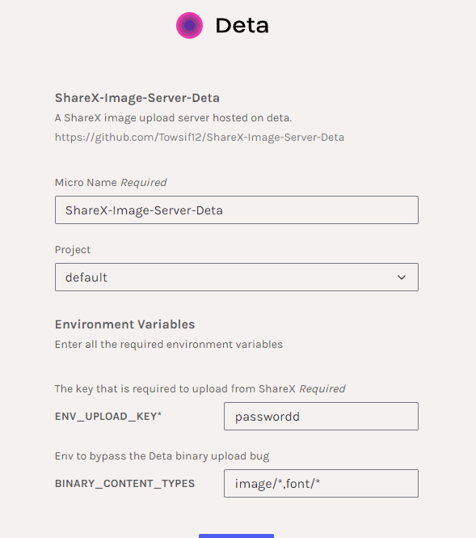
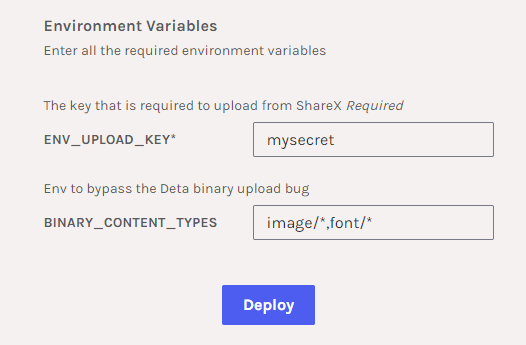
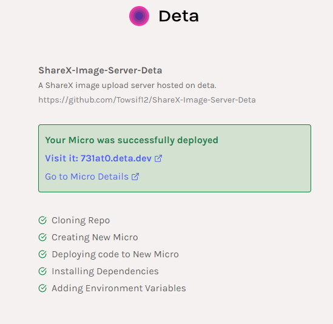
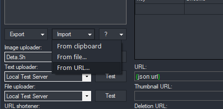
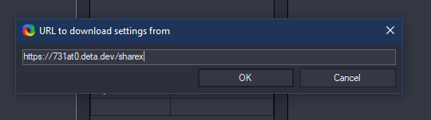
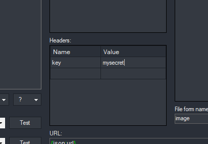
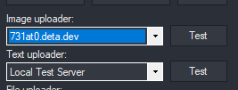

## Hosting in Deta.sh

You can host this project on a Deta Micro. Since Data is a free cloud platform for developers you can host servers there for free.

> Click this button below to get started

### Setup Process 

Before following these steps you **firstly need to create a Deta account** which is fairly easy and will not be discussed here .

After setting up an account you can start by following these steps..

### Step 1 (Setting Up The Server):

This page will appear after you press the **Deploy To Deta** button on this page.

Here you can modify your server's name and select the project you want the micro to be added to. You can also leave that to the default value.

**Make sure to change the ENV_UPLOAD_KEY Environtment Key since It'll be used to authenticate when uploading images.**

**You don't have to change/edit the BINARY_CONTENT_TYPES field.**

After following these steps you are ready to click on **Deploy**.

After the deployment you will be presented with a page like this.
You need to copy the Micro URL. That is required for the next step where we update the ShareX client settings.

**You can also set a custom subdomain for the Micro. Go to Micro Details > Domains > Add a subdomain.**

The server setup process is done.

### Step 2 (ShareX Client):

You need to go to ShareX **Custom Uploader Settings** to connect this server to your ShareX client

Click on import and select the **From URL** option.

Here you'll need to paste the URL you copied from the previous step and add the **/sharex** path to it and click on ok. It will automatically import the configuration.

**After the configuration is loaded, type the server key on the Headers tab**

**Also make sure to change the Image uploader form the dropdown**

**Now you can use ShareX with your custom upload server hosted in Deta**